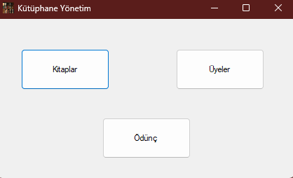
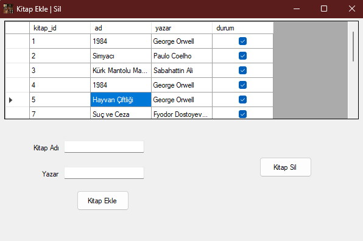
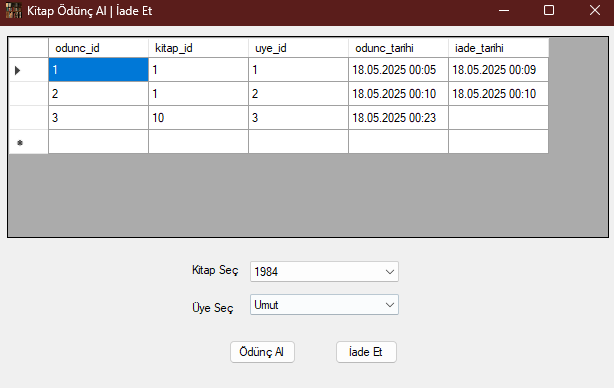
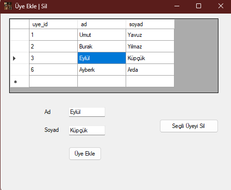

# 📚 Kütüphane Yönetim Sistemi

Bu proje, **C#** ve **SQL Server** kullanılarak geliştirilmiş basit bir **Kütüphane Yönetim Sistemi** uygulamasıdır. Kitap takibi, üye yönetimi ve kitap ödünç verme işlemlerini kolaylaştırmak için tasarlanmıştır.

## 📦 Kurulum

1. Proje klasöründe yer alan `.bak` uzantılı veritabanı yedeğini SQL Server üzerinden kendi sunucunuza **restore** edin.
2. Visual Studio'da `DatabaseHelper.cs` dosyasına gidin ve `server` adını kendi bilgisayarınıza uygun şekilde değiştirin.
3. Projeyi derleyerek doğrudan kullanmaya başlayabilirsiniz.

## 🧰 Özellikler

### 📖 Kitaplar Menüsü

- Var olan kitapları görüntüleyebilirsiniz.
- Yeni kitap ekleyebilir ya da mevcut kitapları silebilirsiniz.

### 👥 Üyeler Menüsü

- Yeni üye ekleyebilir, mevcut üyeleri listeleyebilir ya da silebilirsiniz.

### 🔄 Ödünç Alma Menüsü

- Kitap ve üye seçerek kitap ödünç verebilirsiniz.
- Veritabanı üzerinden ödünç alma ve geri verme tarihlerini takip edebilirsiniz.

## 🖼️ Ekran Görüntüleri

### Ana Sayfa

### Kitaplar Menüsü

### Kitap Ödünç Al Menüsü

### Kullanıcı Yönetim Ekranı

## 🛠️ Kullanılan Teknolojiler

- C# (.NET Framework - Windows Forms)
- SQL Server
- ADO.NET
- WinForms UI

## 📌 Notlar

- Bu proje temel düzeyde hazırlanmış bir Kütüphane Otomasyonu örneğidir.
- Geliştirme amacı eğitimsel olup güvenlik ve kullanıcı rolleri gibi detaylar sadeleştirilmiştir.

## 📄 Lisans

Bu proje kişisel ve eğitimsel kullanım için ücretsizdir. Ticari amaçla kullanılması uygun değildir.
